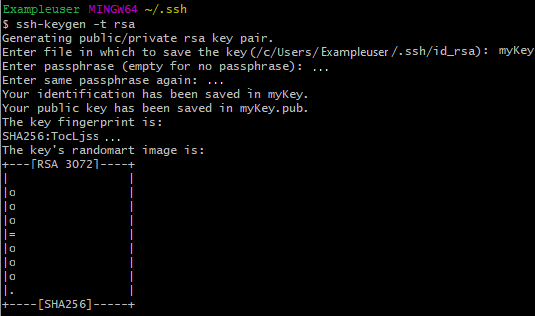
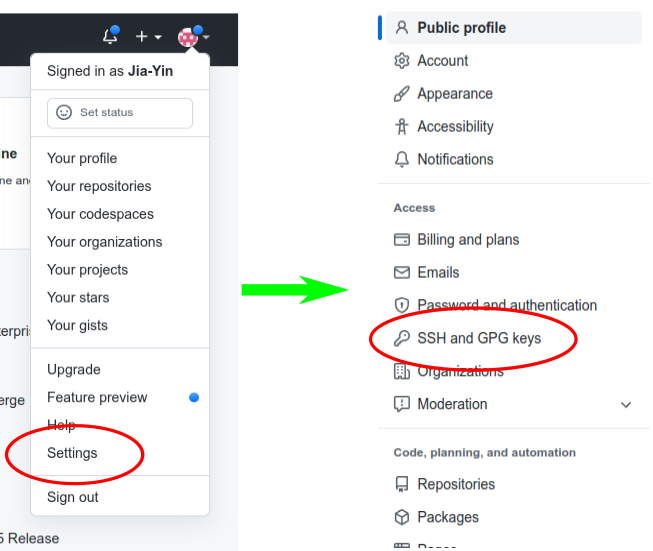
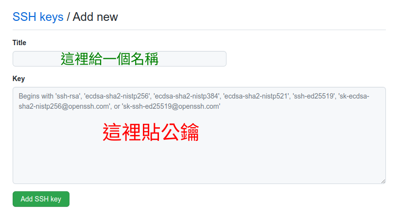

[教學錄影](https://youtu.be/YavSmnOhYvg)

本單元學習在自己的電腦設定開發環境，此處以 Windows 系統為例，學習重點如下：
1. 安裝 Git， 可從這裡下載 [Git](https://git-scm.com/)。
2. 安裝 [Visual Studio Code](https://code.visualstudio.com/)，
也可以試用 [線上版](https://vscode.dev/) 看看，不過功能比較受限。
3. Git 要存取 GitHub 的專案，必須要有憑證。一般先建立公鑰和私鑰對，把公鑰加入 GitHub 中，步驟如下：
   1. 開啟 Git Bash 終端機（從`開始`裡面去找）。
   2. 在終端機使用指令 `ssh-keygen -t rsa` 產生公鑰和私鑰對，一般情況下全部用預設值，一直按 `Enter` 鍵即可。  

        

   3. 使用 `cat` 指令顯示公鑰內容，以剛才的畫面為例，指令為  
      `cat /c/Users/Exampleuser/.ssh/id_rsa.pub`  
      如果正確的話，螢幕會顯示一大串看起來像亂碼的東西。把這堆文字選擇並 Copy 起來，等一下會用到。
   4. 登入 GitHub，在右上角人頭那邊按鍵，然後開啟其中的 `Settings`。接下來看一下左邊，選擇 `SSH and GPG keys`  

      

   5. 接下來在跳出來的畫面中，按右上角的 `New SSH Key`，將剛才複製的公鑰貼到跳出來的畫面，並給一個名稱。填好之後按下 `Add SSH Key`。

      

4. Git 第一次使用，要先設定使用者名稱及 Email。在終端機使用以下指令設定全域的名稱及 Email。把下面的 Username 及 Email 換成你自己的。
    ```Bash
    git config --global user.name "Username"
    git config --global user.email "Email"
    ```
